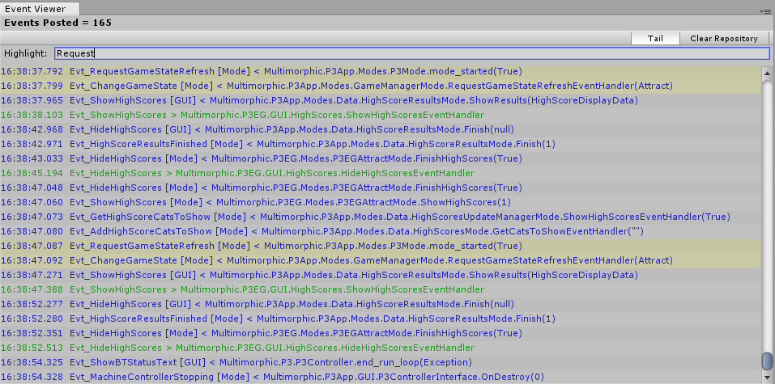

# Event Viewer (Editor Window)

This is a dockable Editor Window that will keep track of posted events so you can see what classes post events and what classes handle those events.

## Usage

**IMPORTANT:** You must ensure that you pass the p3 object to the init method in the constructor of your BaseGameMode override class:

```csharp
public class MyBaseGameMode : BaseGameMode
{
     public MyBaseGameMode (P3Controller controller)    : base(controller)
     {
       // Take precautions to not include in release candidate builds.       
       Packages.BMG.Utility.Init(p3);
       // All other constructor code.
     }
}
```

To open, use this toolbar menu: `BMG->Event Viewer`

### Basics

---

As events are posted (in Play Mode), you will see lines in this window with this format:

`00:00:00.000 <Name> [<Type>] <Direction> <Class.Method>(<Parameters>)`

- `00:00:00.000` = Timestamp of event occurance.
- `<Name>` = Name of the event.
- `<Type>` = Whether this is an event sent by the "GUI" or a "Mode".
- `<Direction>` = < for events posted and > for event recieved. Read as an arrow out of (post) or into (handle) the class name.
- `<Class.Method>` = The full name of the class.method related to the event occurance.
- `<Parameters>` = The parameter(s) sent in this event.
  Note: Some parameters may be very intricate and/or have too much data to display. You can write a custom parser per event string to hsandle and output the parameter data how you choose. See [API](./API.md).


Events posted are shown in blue (configurable) and events handled are shown in green (configurable).

### GUI

---




**Events Posted (label)**
- A count of how many events have been posted since the clearing of the repository that listens for them. Note that lines with green (configurable) font represent events <u>handled</u> and do not count towards events <u>posted</u>. (i.e. That event was already counted as "posted" before it was handled.)

**Tail (Button)**
- When pressed, the window will keep scrolling down to the last event posted. Depress to allow free manual scrolling.

**Clear Repository (Button)**
- When pressed, this will clear the repository of posted events tracked by this utility. It will start back at 0 events and clear the window as it awaits for new events to track.

**Highlight (Text Box)**
- Entering text in here will highlight lines yellow (configurable) that contain this string. This does NOT use Regular Expression, it simply uses [string.IndexOf](https://learn.microsoft.com/en-us/dotnet/api/System.String.IndexOf?view=netframework-2.0).

### Configuration

---

You can configure some features of the Event Viewer window through the BMG Settings. Toolbar: `BMG->Settings`

- Settings in `Events/Repository` will affect the repository in which this tool uses to collect events tracked.

- Settings in `Events/Events: In-Editor Viewer` will affects the viewer window.

---

<mark>Note:</mark> Configuration fields are not documented in this git page. It would be redundant and a bit useless here because there are tooltips when hovering over each field to provide documentation inside the tool itself.
