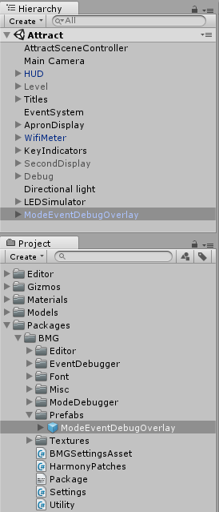
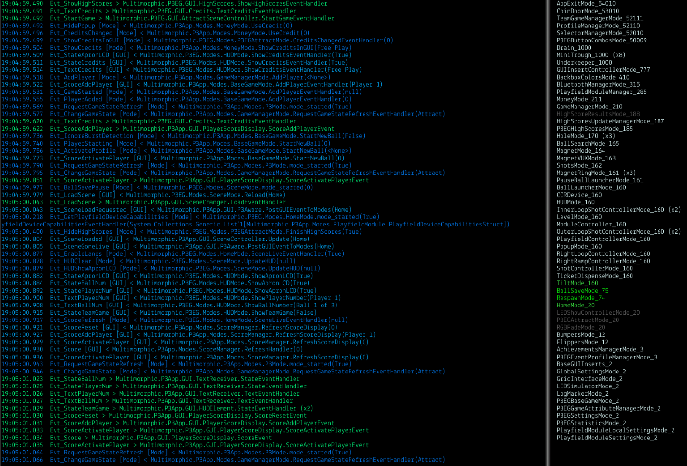
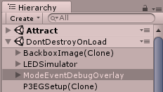

# Mode/Event Debug Overlay

When dragged into a scene, the `BMGOverlays.prefab` will show a live feed of events as they posted and are handled. It will also show what modes have started/added and what modes have since been stopped/removed.

## Usage

**IMPORTANT:** You must ensure that you pass the p3 object to the init method in the constructor of your BaseGameMode override class:

```csharp
public class MyBaseGameMode : BaseGameMode
{
     public MyBaseGameMode (P3Controller controller)    : base(controller)
     {
       // Take precautions to not include in release candidate builds.       
       Packages.BMG.Utility.Init(p3);
       // All other constructor code.
     }
}
```

- Find the `ModeEventDebugOverlay.prefab` file in Unity's Project view.
- Drag it to a scene that loads first in the game. Ideally, the same scene you have a BackboxImage component (if applicable) that displays your backbox background image.
  Do not use the Bootstrap scene, that should be kept as slim as possible.
	- You can also set it up to enable on a P3 operator config setting change or perhaps a special flipper button combo. So you can have a way to toggle it.
- Save the scene.



## Basics


The left pane will show events received in blue (configurable) and events handled in green (configurable). GUI Events show in light blue (configurable). The format of the text is the same described in [Event Viewer - Basics](./EventViewer.md#Basics).

The right pane will show active modes in white (configurable) and inactive modes in grey (configurable). Newly added modes will be green (configurable) and fade to white. The format of the text is the same described in [Mode Viewer - Basics](./ModeViewer.md#Basics).

## Configuration
You can configure some features of the Event Viewer window through the BMG Settings. Toolbar: `BMG->Settings`

- Settings in `Events/Events: In-Game Overlay` will affect event display.
- Settings in `Modes/Modes: In-Game Overlay` will affect mode display.

## Troubleshooting
### Overlay does not show
Try these things in this order:

1. Ensure you call `Packages.BMG.Utility.Init(p3);` as mentioned in [Usage](#Usage) . You can test it out by making sure the [Event Viewer](./EventViewer.md) or [Mode Viewer](./ModeViewer.md) tools work.

2. When your game is running, open Unity's Hierarchy view and check that you see the **ModeEventDebugOverlay** game object under the **DontDestroyOnLoad** scene. If it's not there, it's likely the scene you placed it in was never active. 


3. Check that the ModeEventDebugOverlay game object is active when you expect the overlay to be showing. From this point, you will need to use your Unity debugging skills to see if something in your scene/project is perhaps drawing over it. The Scene View can be used to help.
