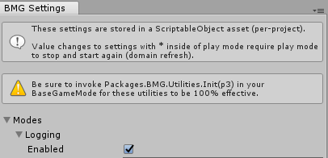
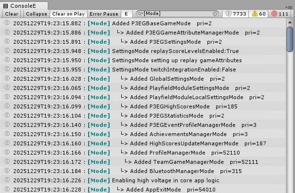

# Mode Logging

Mode logging will enable the logging of when modes are started/added and stopped/removed. 

## Usage
**IMPORTANT:** You must ensure that you pass the p3 object to the init method in the constructor of your BaseGameMode override class:

```csharp
public class MyBaseGameMode : BaseGameMode
{
     public MyBaseGameMode (P3Controller controller)    : base(controller)
     {
       // Take precautions to not include in release candidate builds.
       Packages.BMG.Utility.Init(p3);
       // All other constructor code.
     }
}
```

To use, you must open the settings from this toolbar menu: `BMG->Settings`. Then under `Modes/Logging`, check "Enabled" .


## Basics


Since these are logging through `UnityEngine.Debug.Log`, you will also see them in the console window. When starting/adding a mode results in starting/adding another mode, you will see the next mode indented with "  └>" (configurable). Each subsequent mode added will result in more spaced padding before "└>".

The example shown above shows how the BaseGameMode class kicks off a good amount of modes both directly and indirectly. 

    Also shown above, is the "ConsoleE" window. This is not my tool, it is an enhanced log viewer tool called "Console Enhanced". It is no longer publically available, but you can find it in the SampleApp from the P3 SDK install. As you can see above, I typed "[Mode]" and it only showed me log lines with that text in it.

